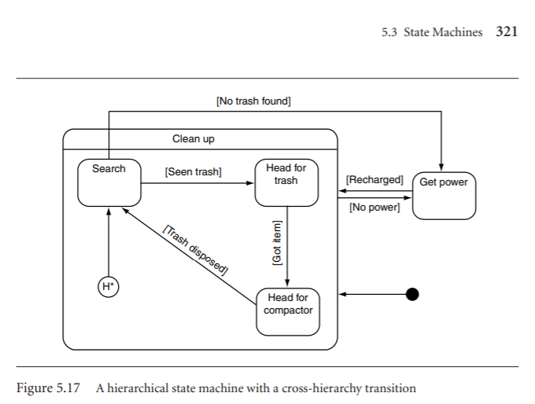

# Game Finite State Machine
Page 309 - State Machines
- Often characters in a game will act in one of a limited set of ways.
They will carry on doing the same thing, until some event or influence
makes them change.

States - On Guard, Fight, Run Away

Transitiions - See small enemy, losing fight, see big enemy, escaped

### Problem
Want general system that supports arbitrary state machines with any
kind of transition condition. The state machine will occupy only one
state at a time.

### Hierarchical State Machines
State Machines can quickly become complex graphs when 
there are many transitions and fall backs. A Hierarchical 
structure can help alieveiate this issues.

